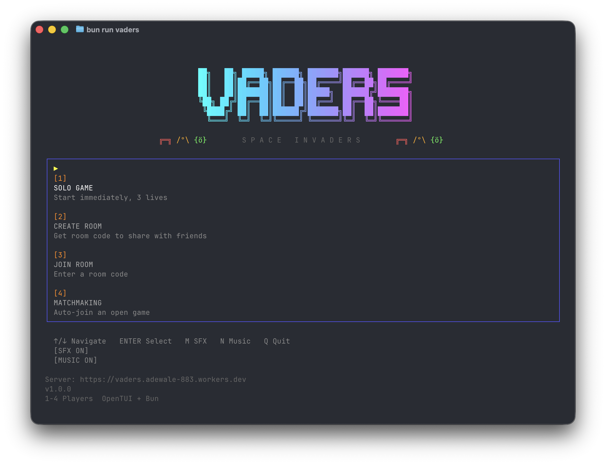

# Vaders

Multiplayer TUI Space Invaders clone (1-4 players) built with OpenTUI and Cloudflare Durable Objects.


<p align="center">
  
</p>

## Quick Start

```bash
bun install
bun run vaders
```

## Controls

| Key | Action |
|-----|--------|
| Arrow Keys | Move left/right |
| Space | Shoot |
| Enter | Ready up / Select |
| S | Start solo game (in lobby) |
| Escape | Back / Cancel |
| M | Toggle sound effects |
| N | Toggle music |
| Q | Quit |

## Game Modes

- **Solo** - 3 lives, standard alien grid
- **Co-op** (2-4 players) - 5 shared lives, larger grid, faster aliens

## Requirements

- [Bun](https://bun.sh) runtime
- Terminal with 120x36 minimum size
- macOS (uses `afplay` for audio) or Linux (uses `aplay`)

## Architecture

```
client/     Bun + OpenTUI React terminal app
worker/     Cloudflare Worker + Durable Object game server
shared/     TypeScript types and protocol definitions
```

## Development

```bash
bun run vaders              # Start game (connects to remote server)
bun run vaders -- --local   # Start game with local server
bun run vaders -- --check   # Run system diagnostics
bun run dev:worker          # Worker only
bun run dev:client          # Client only
```

## Deploy

```bash
cd worker && bunx wrangler deploy
```

## Credits

- Background music: [HydroGene](https://opengameart.org/content/8-bit-epic-space-shooter-music) (CC0)
