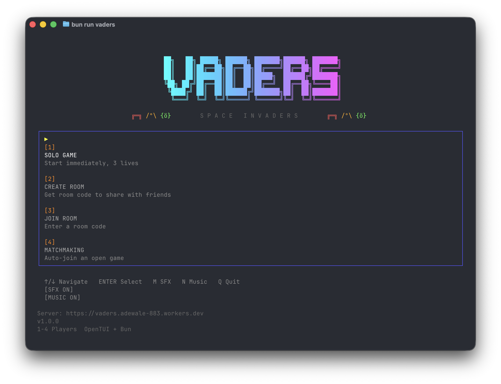
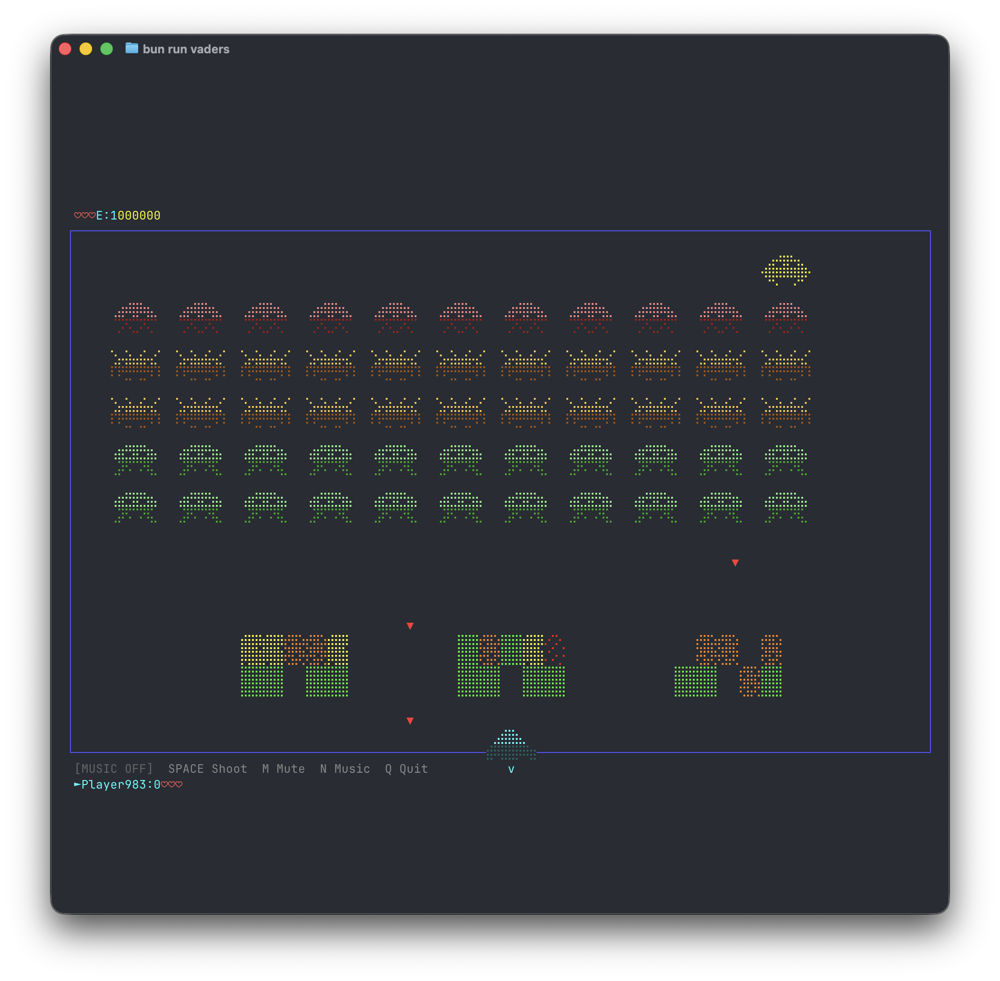

# Vaders

Multiplayer Space Invaders clone (1–4 players) built with OpenTUI and Cloudflare Durable Objects. **Play in your terminal or your browser** — one authoritative server, two frontends, same game.


<p align="center">
  
  
</p>

<details>
<summary>Spritesheet (all game graphics)</summary>

</details>

## Play now

### In your browser — zero install

👉 **<https://vaders.adewale-883.workers.dev>**

Desktop only (viewports ≥600px). Create a room, share the link, play together.

### In your terminal

```bash
bun install
bun run vaders
```

Requires [Bun](https://bun.sh), a terminal at least 120×36, and macOS (`afplay`) or Linux (`aplay`) for audio.

### Browser support

The web build targets **modern evergreen browsers**: the latest two major releases of Chrome, Firefox, Safari, and Edge. It uses ES2022, HTML5 Canvas, Web Audio API, WebSockets, and `crypto.randomUUID`. Older browsers are not supported.

**Vaders is a keyboard-only game.** Mobile and touch input are explicitly out of scope — see `web/src/components/MobileGate.tsx` for the detection and message.

### Cross-frontend coop

TUI and browser players can share the same room. The server is authoritative at 30 Hz and both frontends render the same game state.

## Controls

| Key | Action | Frontend |
|---|---|---|
| ← → | Move | both |
| Space | Shoot | both |
| Enter | Ready up / Select | both |
| Escape | Back / Cancel | both |
| M | Toggle sound effects | both |
| N | Toggle music | both |
| X | Forfeit (during gameplay) | both |
| S | Start solo game (in lobby) | TUI |
| ? | Controls cheatsheet | Web |
| Q | Quit | TUI |

## Game modes

- **Solo** — 3 lives, standard alien grid
- **Co-op** (2–4 players) — 5 shared lives, larger grid, faster aliens, per-player slot colours

## Architecture

Five-package Bun workspace, enforced by CI:

```
shared/        Types, WebSocket protocol, collision, TUI-compat contract
client-core/   Platform-agnostic: animation, connection, input, audio triggers, sprites
client/        Bun + OpenTUI React TUI frontend
web/           Browser React + HTML5 Canvas frontend (Vite, Vitest, Playwright)
worker/        Cloudflare Worker + Durable Object authoritative 30 Hz game server
```

`client-core/` may not import `@opentui/*`, `bun:*`, or `node:*` — a CI grep check enforces the rule. Each frontend plugs in platform adapters (`InputAdapter`, `AudioAdapter`, `FrameScheduler`, `VisualConfig`).

## Development

### Running locally

```bash
bun run vaders                     # TUI, connects to the deployed server
bun run vaders -- --local          # TUI, connects to a local worker
bun run vaders -- --check          # System diagnostics
bun run dev:worker                 # Worker only
bun run dev:client                 # TUI only
cd web && npx vite                 # Web dev server on localhost:5173
```

### Cross-frontend multiplayer test

Start a local worker, start the web dev server against it, then join from the TUI:

```bash
# Terminal 1 — worker
cd worker && npx wrangler dev --port 8787

# Terminal 2 — web
cd web && VITE_SERVER_URL=http://localhost:8787 npx vite --port 5173

# Terminal 3 — TUI joins the room created in the browser
VADERS_SERVER=http://localhost:8787 bun run vaders -- --room ABC123
```

### Deploy

```bash
bun run deploy
```

Runs `vite build → wrangler deploy → verify-deploy-coherence`. The coherence check fails fast if the web bundle and Worker `/health` report different commit hashes (see `scripts/verify-deploy-coherence.mjs`).

## Further reading

- `CLAUDE.md` — architecture overview and coding conventions
- `specs/vaders-spec.md` — full game design spec
- `specs/web-frontend-spec.md` — multi-frontend refactor spec
- `Lessons_learned.md` — what went right, what went wrong, and what we'd do differently
- `CHANGELOG.md` — release notes

## Credits

- Background music: [HydroGene](https://opengameart.org/content/8-bit-epic-space-shooter-music) (CC0)

## License

MIT (see the `license` field in `package.json`).
